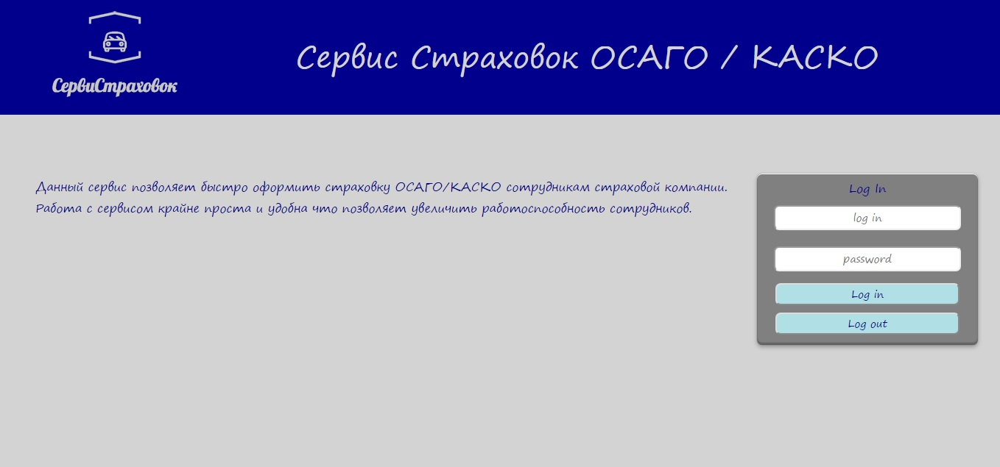

# Проект #

# Insurance Service (Сервис Страховок)  #

### Что это такое? ###

Данное приложение является веб-сервисом. Сервис позволяет быстро и просто оформить страховку.
Все данные по страховка сохраняются в базе данных. Данное приложение позваоляет в результате
оформления страховки сохранить ее в формате PDF или же распечать. Все что требуется от клиента и страхователя
это всего лишь поставить подписи и печать.

#### Кому это нужно? ####

Данный сервис окажет огромную пользу страховым компаниям. Программа позволит не только
повысить работоспособность сотрудников страховой компании, но и вести статистику а так
же сохранять все данные.

#### Какие виды страховок можно оформить? ####

* ОСАГО
* КАСКО

### Как это работает? ###

1. Необходима регистрация пользователя. Можно войти в сервис как страховщик, либо как администратор.
Страховщик имеет возможность совершать страхование. Администратор может следить за статистикой.

2. После регистрации необходимо войти в сервис.

3. Как страховщик вы можите:
    
    * Следить за своей статистикой
    * Оформлять страховку новым клиентам
    * Офрмлять страховку старым клиентам
    * Сохранять недооформленные страховки
    * Дооформить прежнюю страховку
    * Сохранять в PDF готовые страховки
    * Печатать готовые страховки
    
4. Как администратор вы можите:

    * Смотреть статистику по определеннвм критериям (например за определенный период)
    * Удалять недооформленные страховки
    
5. После работы в сервисе необходимо совершить выход

### Как собрать приложение? ###

Проект собирается через maven. Все зависимости указываются в pom.xml(все уже готово, необходимо просто запустить
сборщик).

### Как запустить приложение? ###

Чтобы запустить приложение необходимо архив проекта с расширением **.war** поместить в сервер и запустить его.
